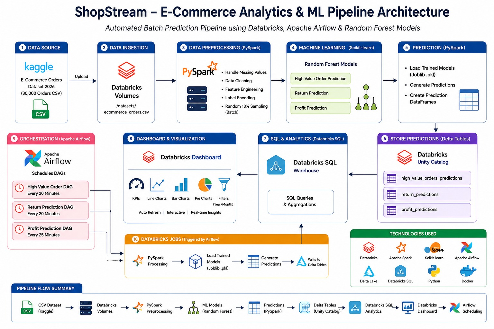
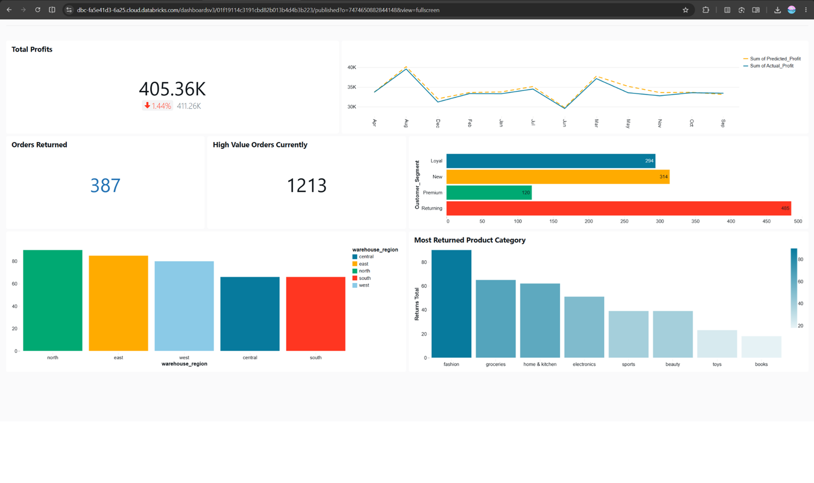
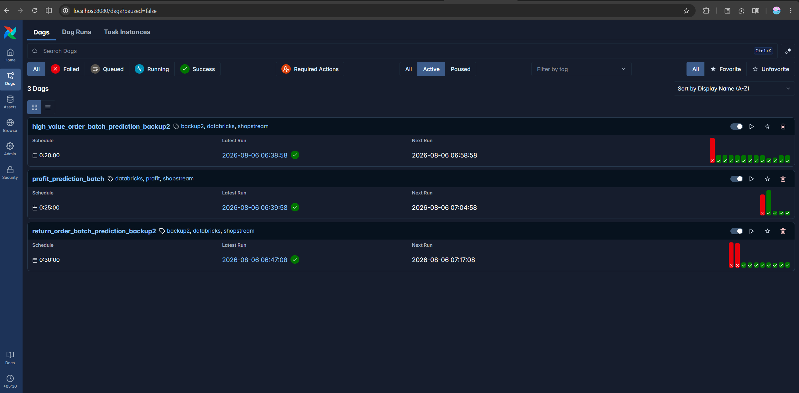

# ShopStream

### End-to-End E-Commerce Data Engineering, Machine Learning & Analytics Platform

ShopStream is an end-to-end e-commerce analytics and machine learning project developed as part of the CDAC PGCP Big Data Analytics final project.

The project processes e-commerce order data using PySpark, performs exploratory analysis and feature engineering, develops machine learning models, automates batch prediction workflows using Apache Airflow, and presents the resulting business insights through Databricks SQL and an interactive Databricks Dashboard.

**CDAC Thiruvananthapuram — PGCP Big Data Analytics, Final Project (Feb 2026 Batch)**

## My Contribution

- Built a Dockerized Apache Airflow environment to automate Databricks Jobs and ML prediction workflows
- Integrated Airflow with Databricks to trigger batch predictions and update the dashboard with new results
- Set up and managed the complete Databricks environment for the project
- Developed the high-value order classification ML workflow
- Implemented and integrated the ML models and prediction pipelines in Databricks
- Built and configured the Databricks Dashboard for the project

## Project Architecture

## Databricks Dashboard

The final prediction results and business KPIs are presented through an interactive Databricks Dashboard.

## Apache Airflow Pipeline

Apache Airflow is used to schedule and orchestrate the batch prediction workflows.

## Machine Learning

The project includes machine learning pipelines for:

- High-value order prediction
- Return order prediction
- Actual vs Predicted Profit analysis

## Data Engineering

- Data ingestion and processing using PySpark
- Data cleaning and preprocessing
- Feature engineering
- Batch processing
- Prediction generation
- Dockerized Apache Airflow environment for workflow orchestration
- Automated triggering and scheduling of Databricks Jobs and pipelines

## Technologies

- Python
- PySpark
- Apache Spark
- Scikit-learn
- Random Forest
- Databricks
- Databricks SQL
- Apache Airflow
- Docker
- Git & GitHub

## Project Highlights

- Built a Dockerized Apache Airflow environment to automate Databricks Jobs, run ML predictions on new data, and update the dashboard with the results
- Processed and transformed e-commerce data using PySpark on Databricks
- Developed ML workflows for high-value order and return prediction
- Performed actual vs predicted profit analysis
- Built an interactive Databricks Dashboard for business insights

## Project Outcome

ShopStream demonstrates an end-to-end workflow for transforming raw e-commerce data into machine learning predictions and business insights, bringing together data engineering, machine learning, workflow orchestration, SQL analytics, and dashboarding in a single project.

## Team

| Name | GitHub |
|------|--------|
| Abhay Mahajan | [@Abhay-san](https://github.com/Abhay-san) |
| Arvind Kasbe | [@Arvind-K9](https://github.com/Arvind-K9) |
| Bunty Virwani | [@bvirwani123](https://github.com/bvirwani123) |
| Shrutika Gaikwad | [@Shrutika12345](https://github.com/Shrutika12345) |
| Sravan Branwal | [@sravan-kb](https://github.com/sravan-kb) |